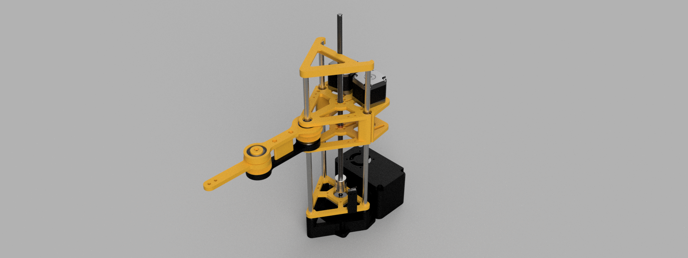
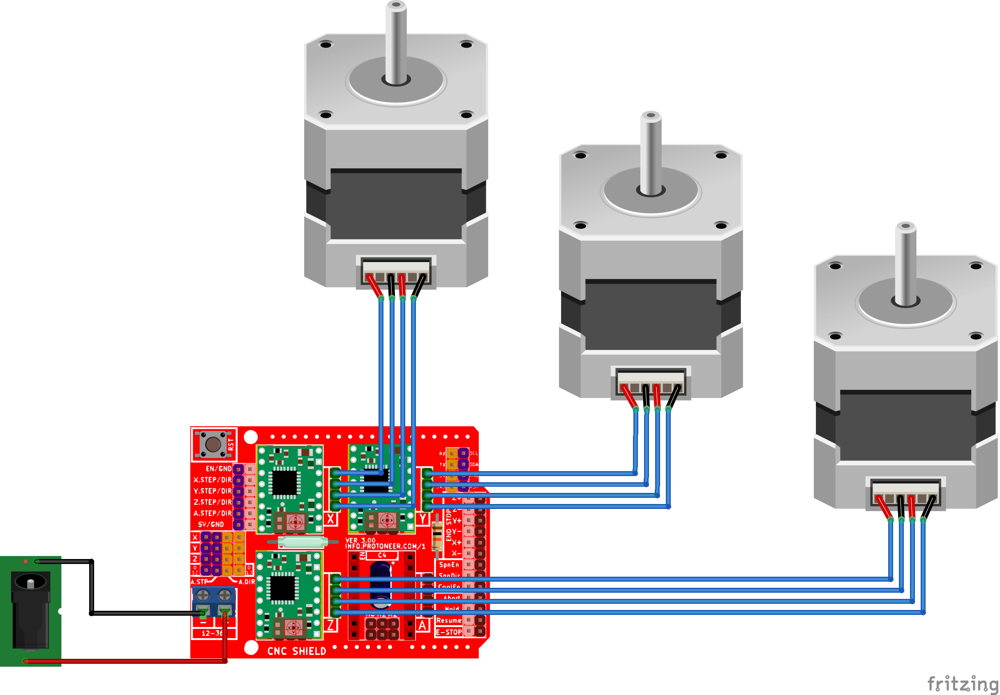
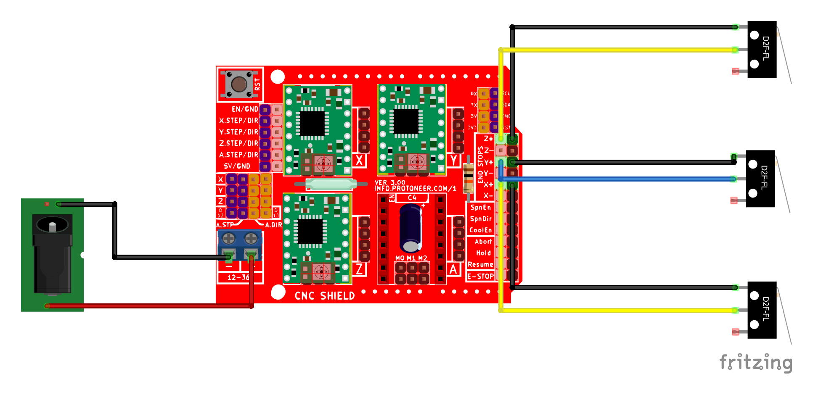

# SCARA



The SCARA (Selective Compliance Assembly Robot Arm) is a type of robotic arm designed for tasks requiring high precision and speed, like assembly and pick-and-place operations. Its configuration allows for rigid vertical movement while maintaining flexibility in the horizontal plane. 

This repository contains the design files, source code, and documentation for my SCARA robotic arm (forgive the redundancy). The arm is mostly 3d printed in order to offer a balance between affordability and functionality.

## Project history and current state

I wanted to build a simple robotic arm and found out the [pyBot](https://jjrobots.com/) project that seemed to have a lot of potential and looked like a good starting point for further development. As I finished assembling the hardware according to the guide, the domain for the website hosting the project expired and was not renewed. At the time of writing this README, the site is still offline, meaning I no longer had access to the original code. The printable files are still available on Thingiverse [here](https://www.thingiverse.com/thing:4579405), and the Hackaday page is still accessible [here](https://hackaday.io/project/175419-pybot-scara-robotic-arm-3d-printed-python).

Considering the situation, I decided to build my own robotic arm taking inspiration from this project. I redesigned everything from scratch in Fusion 360 to have precise control over the robot arm's parameters and to have accurate measurements for the inverse kinematics. The improvements with respect to the previous version include:

- tensioners for joint 2 and 3.
- endstops for each motor, essential for calibration and to recover from missed steps.
- heat set inserts to avoid screwing directly into the plastic.
- simplified assembly for joints 2 and 3.
- improved `z_base` support to joints 2 and 3, now consisting of two pieces.
- control box for better organization, with optional fan to keep the stepper driver cool.
- universal tool mounting point (not limited to the previous servo motor insert).
- cleaner code with no external dependency (I wrote all the libraries I used), modular and easy to read and understand .

Some renders of the arm in Fusion 360:

|  |  |
|--------------------------------------------------|--------------------------------------------------|
|  |  |

The original project used a DEVIA board, which is an Arduino Zero with built-in sockets for three A4988 stepper motor drivers and onboard drivers for four servos. I opted for an Arduino Uno paired with a CNC shield because it is more accessible, easy to find, and I happened to have both lying around. This setup provides four sockets for stepper drivers and three pins that can be used for the endstops or the end-effector. I also added a 12V mini fan (used for 3d printers) to cool the stepper drivers but this is totally optional. 

## Examples

[](https://www.youtube.com/watch?v=YOUTUBE_VIDEO_ID_HERE)

[](https://www.youtube.com/watch?v=YOUTUBE_VIDEO_ID_HERE)

[](https://www.youtube.com/watch?v=YOUTUBE_VIDEO_ID_HERE)

## 3D printing

You can find all the parts to print in the [hardware/printed_parts](/hardware/printed_parts) folder. Alternatively, you can get them on the platforms below: 

<p align="center">
  <a href="https://makerworld.com/en/models/572256#profileId-492414">
    
  </a>
</p>

<p align="center">
  <a href="https://www.thingiverse.com/thing:6743905">
    
  </a>
</p>

<p align="center">
  <a href="https://www.printables.com/en">
    
  </a>
</p>

## Assembly instructions

Check out [here](/hardware/BOM.md) for the Bill of Materials and some notes on what you will need. [Here](/hardware/assembly.pdf) you can find the pdf version of the assembly instructions (that also contains a section on the electronics).

Use this QR code ([link](https://instructions.online/?id=12092-scara) if you want to follow the instructions on another device:

<p align="center">
  
</p>

<!--
<p align="center">
  <a href="https://instructions.online/?id=12092-scara">
    
  </a>
</p>
-->

<!--
## Electronics

<p align="center">
  
</p>

Note:
- Sometimes the cables can have a different color order at the extrema; you should match the connections in this picture;
- Use 3 jumpers for each stepper driver to set the microstepping to 16 (this is what is currently in the config)
  or change the `MICROSTEPPING` value in the config;

<p align="center">
    
</p>

After assembling everything and putting together the electronics: download the project > open `software/SCARA/SCARA.ino` from the arduino IDE > compile and upload to the arduino.

-->

## Brief software overview

Summary of the content of each file:

- `vector.hpp`: variable-length vector template class;
- `matrix.hpp`: matrix template class; each matrix has fixed size (not resizable) and exposes methods to compute the determinant, transpose, inverse and even the pseudoinverse along with the classic utility methods   (e.g. indexing, multiplication by matrix/vector etc.);
- `structs.hpp`: structures used to make the code more readable and compact (Point, IKSolution, Steps);
- `button.hpp`: code to handle button events (button pressed and released);
- `logger.hpp`: logger to print formatted strings filtering by logging level (info, warn, error, debug);
- `stepper.hpp`: code to control a stepper motor and make it cover a distance following a trapezoidal/triangular speed profile (everything is expressed in steps, steps/s, steps/s^2);
- `config.hpp`: config file with kinematic structure and velocity/acceleration related constants; You can edit this to adapt the code to your needs;
- `kinematics.hpp`: everything related to this particular robot's kinematics (direct and inverse kinematics, joint velocities computation, ...);
- `SCARA.ino`: main sketch exposing methods to follow a specified trajectory and reach a cartesian point or a joint configuration;

We can use:
- `reachJoint(IKSolution, ...)` to reach a joint configuration with a trapezoidal speed profile;
- `reachCartesian(Point, ...)` to reach a cartesian point with a trapezoidal speed profile;
- `moveStraightLine(Point, Point, ...)` to move between two cartesian points in a straight line interpolating on intermediate positions; we use a linear speed profile between each pair of intermediate points;
- `moveArc(Point, Point, ...)` to move between two cartesian points on an arc interpolating on intermediate positions; we use a linear speed profile between each pair of intermediate points;
- `executeTrajectory(Vector<Point>, ...)` to follow geometric paths; we use the `moveArc(Point, Point, ...)` method between each pair of points; 

<!--
A trajectory is a geometric path + a timing law. In our case things are much simpler and a trajectory is assumed to be a list of points to be reached one after another with a certain velocity (in steps/s). Even if the code to compute joint velocities and thus realize a particular end effector velocity is partially there, I'm not using it (yet?). 

To define your trajectory, replace the section in `SCARA.ino` where the points are added to the trajectory vector. The points in the following example describe a circular trajectory with radius 0.05, center (0.12, 0) and z=0.05 meters:

```cpp
  // Circle (10 points) with radius 0.05  and center (0.12, 0) [meters]
  trajectory.pushBack(Point(0.17, 0.00, 0.05));
  trajectory.pushBack(Point(0.16, 0.03, 0.05));
  trajectory.pushBack(Point(0.14, 0.05, 0.05));
  trajectory.pushBack(Point(0.10, 0.05, 0.05));
  trajectory.pushBack(Point(0.08, 0.03, 0.05));
  trajectory.pushBack(Point(0.07, 0.00, 0.05));
  trajectory.pushBack(Point(0.08, -0.03, 0.05));
  trajectory.pushBack(Point(0.10, -0.05, 0.05));
  trajectory.pushBack(Point(0.14, -0.05, 0.05));
  trajectory.pushBack(Point(0.16, -0.03, 0.05));
```

Calling `executeTrajectory(trajectory)` after this will make the robot execute the trajectory (if feasible i.e. all points are within the reachable workspace and the velocities and acceleration are well conditioned). By default the velocities and acceleration used are the ones defined in the `config.cpp` file but can bypassed using the `executeTrajectory` method's parameters.

-->

## TODO

- [ ] Add more renderings
- [ ] Add assembly instructions
- [ ] Add schematic diagram
- [ ] Design a universal mounting block to attach tools to the forearm
- [x] Forget AccelStepper/MobaTools and write your own library to simultaneously control multiple steppers
- [ ] Add forearm calibration endstop
- [x] Complete the BOM with the list of M3 screws needed
