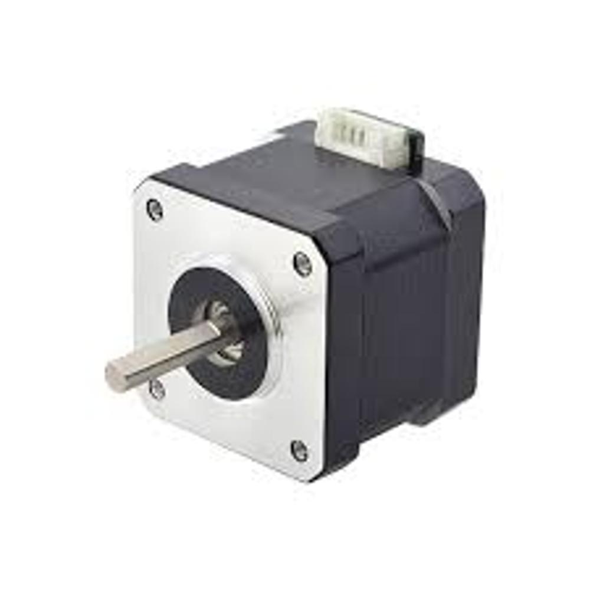
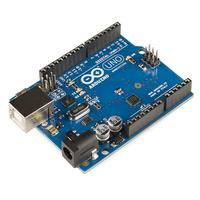
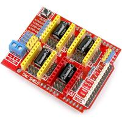
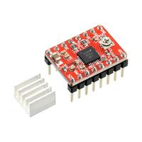
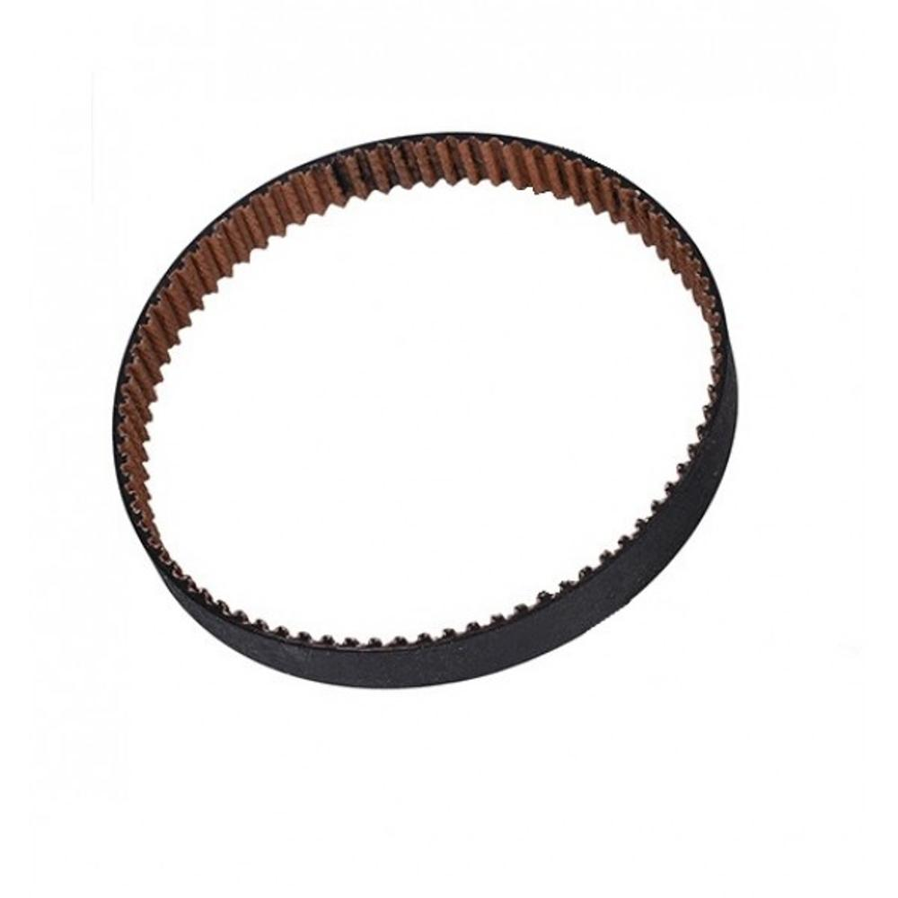
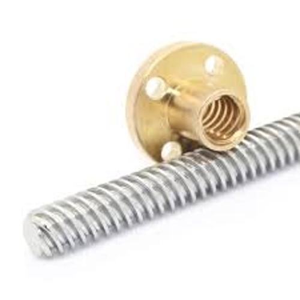

# Bill of Materials (BOM)

| Component          | Quantity | Description                             | Cost (per unit) | Link | Image |
|--------------------|----------|-----------------------------------------|----------------|------|-------|
| NEMA17 Stepper Motor | 3        | 1.8° step angle, 12V, 1.5A             | $15.00         | [Link](#) |  |
| Arduino Uno         | 1        | Microcontroller board                   | $25.00         | [Link](#) |  |
| CNC Shield          | 1        | Arduino Uno compatible shield for CNC  | $10.00         | [Link](#) |  |
| Stepper Motor driver | 3        |                                          | $10.00         | [Link](#) |  |
| Timing Belt         | 2        | GT2, 6mm width, 2 meters long           | $5.00          | [Link](#) |  |
| Lead Screw          | 1        | 8mm diameter, 300mm length, with POM nut | $8.00          | [Link](#) |  |

## Notes

- I used [this M3 hex screw kit](); it includes all the screws that you will need for this project:
  
- I did not include zip ties and spiral wraps in the table;
- I used this [labeling machine]() to add labels to the cables:
    
